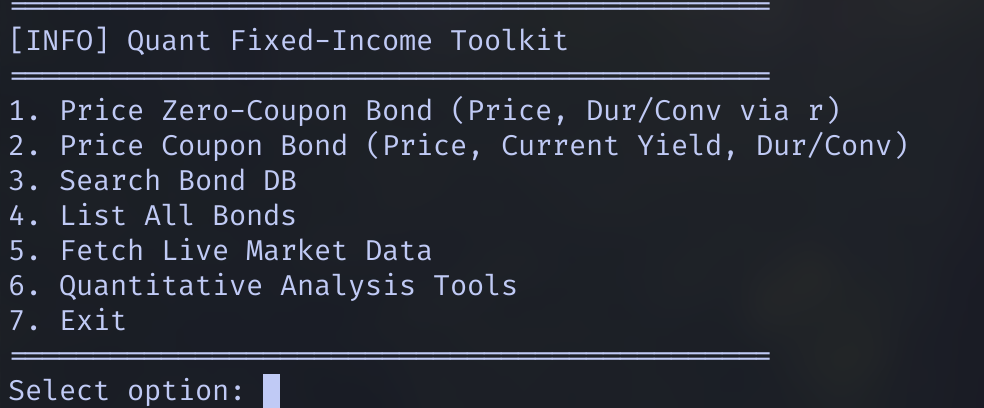
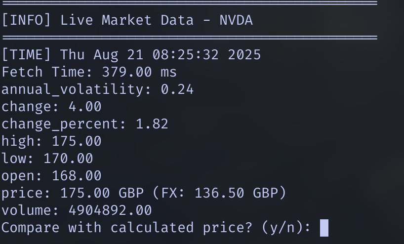

# Bond Pricing and Analysis Toolkit

A professional quantitative finance application for bond pricing, yield calculation, and market data analysis.

This professional quantitative finance application for **educational purposes only**.  
This project demonstrates bond pricing, yield calculation, and market data analysis.  
**Not intended for real financial or investment decisions.**

---

## Features

- Zero-coupon and coupon bond pricing
- Duration and convexity calculations
- Yield-to-maturity (YTM) estimation
- Live market data integration via Alpha Vantage API
- Quantitative analysis tools
- SQLite database storage
- Multi-currency support (USD, EUR, GBP, JPY)

---

## Requirements

- C++20 compatible compiler
- CMake 3.12+
- SQLite3
- JSONCPP library
- Python 3.x with `requests` package

---

## Installation

### 1. Install dependencies

**Ubuntu/Debian:**
```bash
sudo apt-get install build-essential cmake libsqlite3-dev libjsoncpp-dev python3 python3-pip

**macOS**
brew install cmake sqlite3 jsoncpp pytho
```

### 2. Install dependencies
```bash
pip3 install requests
```

### 3. Create a .env file 
```bash
ALPHA_API_KEY=your_alpha_vantage_api_key_here

```

### 4. Create project  
```bash
git clone <repository-url>
cd Bond-Pricer
mkdir build
cd build
cmake ..
make
```

### 5.Project Structure 
Bond-Pricer/
├── include/
│   ├── bond.h
│   ├── db.h
│   └── market_data.h
├── src/
│   ├── bond.cpp
│   ├── db.cpp
│   ├── main.cpp
│   └── market_data.cpp
├── fetch_market_data.py
├── CMakeLists.txt
├── .env
└── README.md

